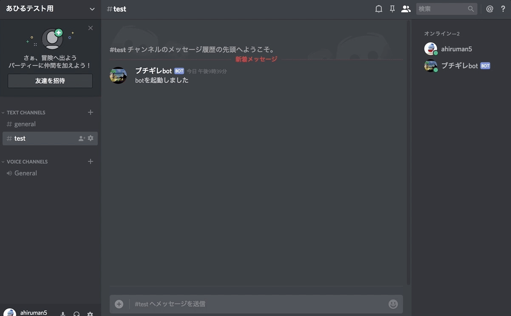
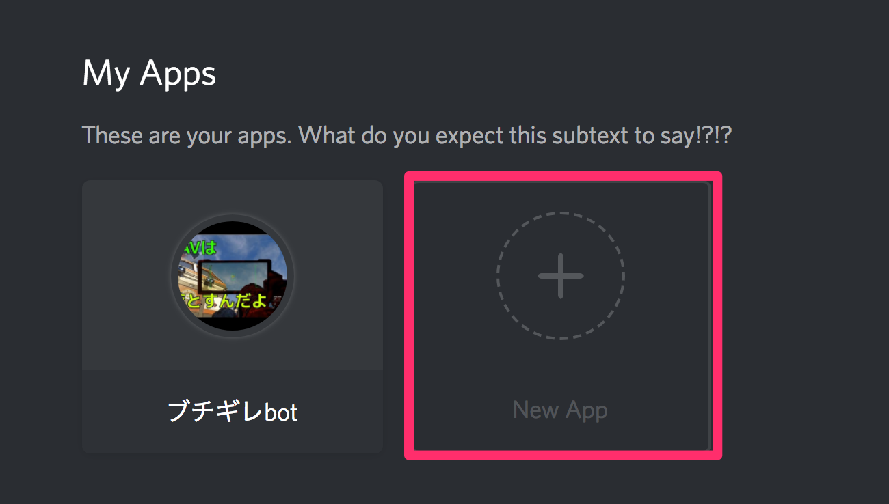
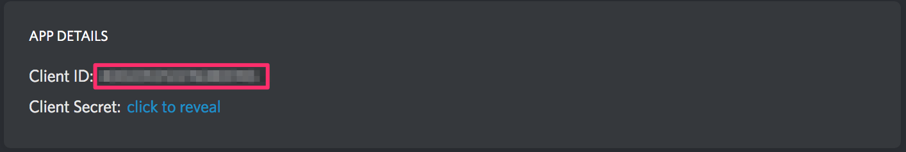
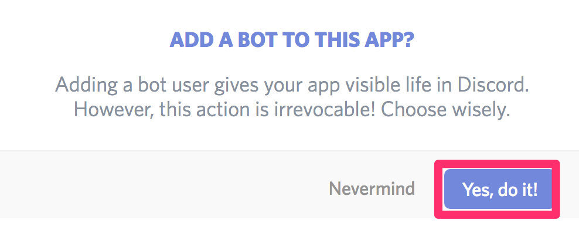
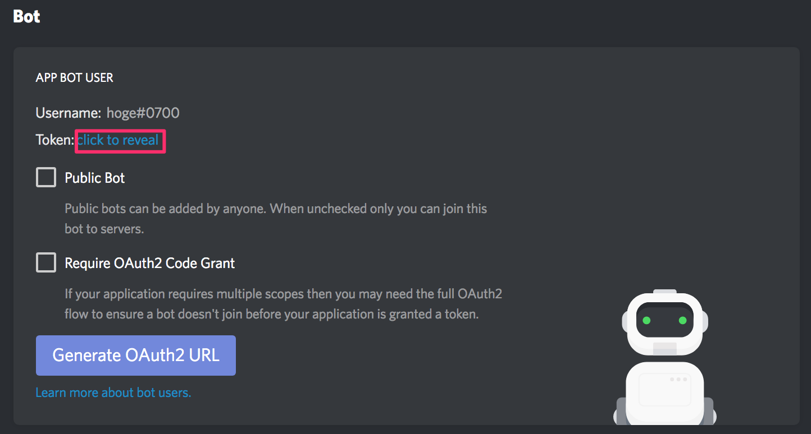
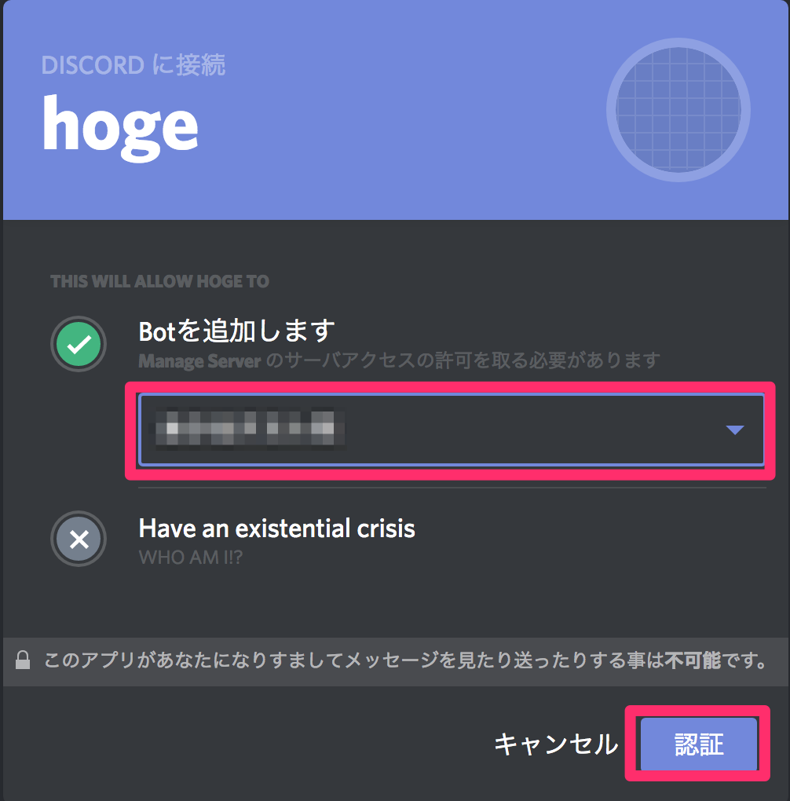

# discord_voice_bot

Discord用ボイスBot

## Description

ボイスチャンネルに語録やSE、音楽を流すBotです。  
様々な形式の音声ファイルに対応してます。  
特定ユーザのボイスチャンネル入室時に入室音を再生することも可能です。  

## DEMO



## 環境設定

1. Discordの開発者ページからアプリケーションを作成する  
https://discordapp.com/developers/applications/me にアクセス

「New App」をクリック

「APP NAME」でアプリケーション名を入力して「Create App」をクリック

「Client ID」をメモしておく

「Create a Bot User」をクリック

「Yes, do it!」をクリック

「click to reveal」をクリック

「TOKEN」をメモしておく

2. 作成したBotをサーバに登録する  
以下にアクセス(client_idは1でメモした「Client ID」)  
`
https://discordapp.com/api/oauth2/authorize?client_id=<client_id>&scope=bot&permissions=0
`

登録サーバを選択し「認証」をクリック  
※追加できるサーバは「サーバ管理」権限を与えられた役職に属している必要があります

3. ffmpegを導入  
導入方法は各OS毎に違うので説明は省略します

## Bot起動方法

1. git clone後、必要なnpmパッケージをインストール
```
$ git clone https://github.com/ahiruman5/discord_voice_bot.git
$ cd discord_voice_bot
$ npm install
```

2. 環境設定1でメモしたTOKENを.envの「TOKEN_ID」にセットする(**必須**)
```.env
TOKEN_ID='TOKEN_ID'
```

3. voiceList/以下に音声ファイルを置きBotを起動する
```
$ npm start
```

### Bot用のテキストチャンネルにメッセージ送信した時のみ反応するようにする
普段使うテキストチャンネルがBotで埋まるのが困る人は以下のコマンドで取得した  
テキストチャンネルIDをメモ
```
$ npm run getTextChannelList
xxxxxxxxxxxxxxxxxx => サーバ名: YOUR_SERVER_NAME, テキストチャンネル名: TEXT_CHANNEL_NAME
.
.
.
```
xxxxxxxxxxxxxxxxxx部分のテキストチャンネルIDを.envにセットする

```.env
TEXT_CHANNEL_ID='TEXT_CHANNEL_ID'
```
指定したテキストチャンネルのみにBotが反応するようになる

## Botの使い方

**Botを追加したサーバで「.」ドットに続けて以下のメッセージを送信**
```
> .list
「.」に続けて以下のメッセージを送信してください
list => 一覧表示
leave => ボイスチャンネルから退出
0 => 音声ファイル名
1 => 音声ファイル名
.
.
```
再生可能な音声一覧を出力

```
> .0
```
数字を指定して音声再生

```
> .leave
```
ボイスチャンネルからBot退出

**ユーザ毎に入室音を設定する**  
joinedVoiceList.jsonにユーザ名と再生したい番号を指定する
```joinedVoiceList.json
{
  "ahiruman5": 0,
  "user02": 6,
  "user03": 14
  }
```
Botを再起動で反映

## Author

[@ahiruman5](https://qiita.com/ahiruman5)

## License

[MIT](http://ahiruman5.mit-license.org)
